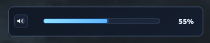
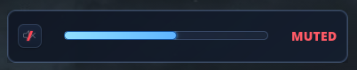

# HyprVolume

GTK4 + `gtk4-layer-shell` volume OSD for Hyprland.

## Visual Example





## Requirements

Runtime:

- Hyprland (Wayland session)
- PipeWire/WirePlumber with `wpctl` available (`/usr/bin/wpctl`, `/usr/local/bin/wpctl`, or `/bin/wpctl`)
- `jq` (used by install script to read `enable_slide`)

Build:

- `gcc` (or compatible C11 compiler)
- `make`
- `pkg-config`
- `gtk4` development files
- `gtk4-layer-shell` development files

## Build

```sh
make
```

The default build compiles directly from `src/*.c` into `hyprvolume` and does not keep project-local `.o` object caches.

Warnings as errors:

```sh
make strict
```

Generate `compile_commands.json` for clangd/IDE diagnostics:

```sh
make compdb
```

## Install / Uninstall

Install binary + config + Hyprland startup hook:

```sh
make install
```

Reset config to latest shipped defaults:

```sh
make install-reset-config
```

Reset only the shipped style.css while keeping current config:

```sh
make install-reset-style
```

Uninstall (keep config):

```sh
make uninstall
```

Uninstall and remove config:

```sh
make uninstall-purge
```

Install uses the `hyprvolume` binary and a managed Hyprland snippet.
Install manages a namespace-scoped layer rule for slide animation:
- `enable_slide: false` writes `no_anim = on` for `match:namespace = ^hyprvolume$`
- only `hyprvolume` is affected; no other layer app rules are touched

## Run manually

Watch mode:

```sh
./hyprvolume --watch --watch-poll-ms 120 --timeout-ms 1200
```

Watch-mode performance behavior:

- while the popup is visible, polling uses `watch_poll_ms`
- while hidden, polling automatically backs off to a slower idle interval to reduce CPU load
- transient `wpctl` query failures are retried in-place so the watcher stays alive instead of exiting

One-shot mode:

```sh
./hyprvolume --from-system --no-watch --timeout-ms 1200
```

## Config

Default path:

- `$HOME/.config/hyprvolume/config.json`

Load config explicitly:

```sh
./hyprvolume --config "$HOME/.config/hyprvolume/config.json"
```

CLI options override config values.

Config validation is strict:

- unknown top-level keys are rejected
- duplicate top-level keys are rejected
- trailing commas are rejected

Custom CSS can be loaded from file:

- `--css-file "$HOME/.config/hyprvolume/custom.css"`
- `--css-append` keeps built-in theme CSS and applies custom CSS afterwards
- `--css-replace` skips built-in theme CSS and uses only custom CSS
- `--vertical` / `--horizontal` toggles layout direction
- `--css-replace` validation is resolved after config + CLI merge, so config-provided `css_file` works correctly with CLI `--css-replace`

Default install ships and uses:

- `$HOME/.config/hyprvolume/style.css` as the user-editable style file
- `css_replace: true` and `css_file` set to that path in fresh/reset config
- use `make install-reset-style` to restore style.css defaults

Custom CSS requirements:

- file must be a regular UTF-8 text file
- GTK CSS parsing errors are reported and style load is rejected

### Positioning

Percent placement:

- `x_percent`: `0..100` (left to right)
- `y_percent`: `0..100` (top to bottom)

Centered example:

```json
{
  "x_percent": 50,
  "y_percent": 50
}
```

Anchor placement is also supported:

- `anchor`: `top-center`, `top-left`, `top-right`, `bottom-center`, `bottom-left`, `bottom-right`
- `margin_x`, `margin_y`

### Supported keys

- `watch_mode` (bool)
- `use_system_volume` (bool)
- `enable_slide` (bool, installer-managed Hyprland layerrule toggle)
- `css_file` (string, optional)
- `css_replace` (bool)
- `timeout_ms` (100-10000)
- `watch_poll_ms` (40-2000)
- `monitor_index` (-1 = default monitor)
- `anchor` (string)
- `x_percent` (0-100)
- `y_percent` (0-100)
- `margin_x` (0-500)
- `margin_y` (0-500)
- `width` (40-1400)
- `height` (20-300)
- `vertical` (bool)
- `radius` (0-200)
- `icon_size` (8-200)
- `font_size` (8-200)
- `background_color` (CSS color)
- `border_color` (CSS color)
- `fill_color` (CSS color)
- `track_color` (CSS color)
- `text_color` (CSS color)
- `icon_color` (CSS color)

Reference defaults:

- `assets/default-config.json`

## Default style

Shipped defaults are centered and riced for a cleaner look:

- smaller percentage text (`font_size: 14`)
- blue gradient slider accent (`fill_color`)
- indigo track contrast (`track_color`)
- dark glass panel tone (`background_color`)
